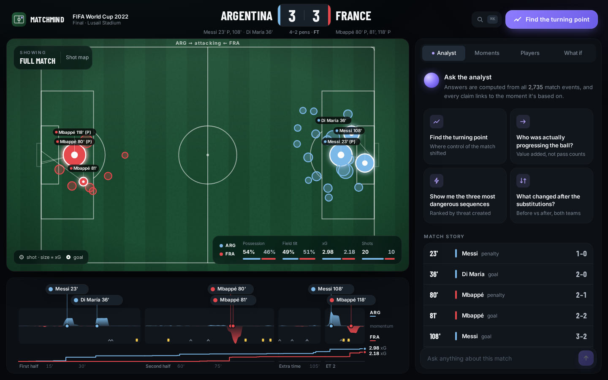
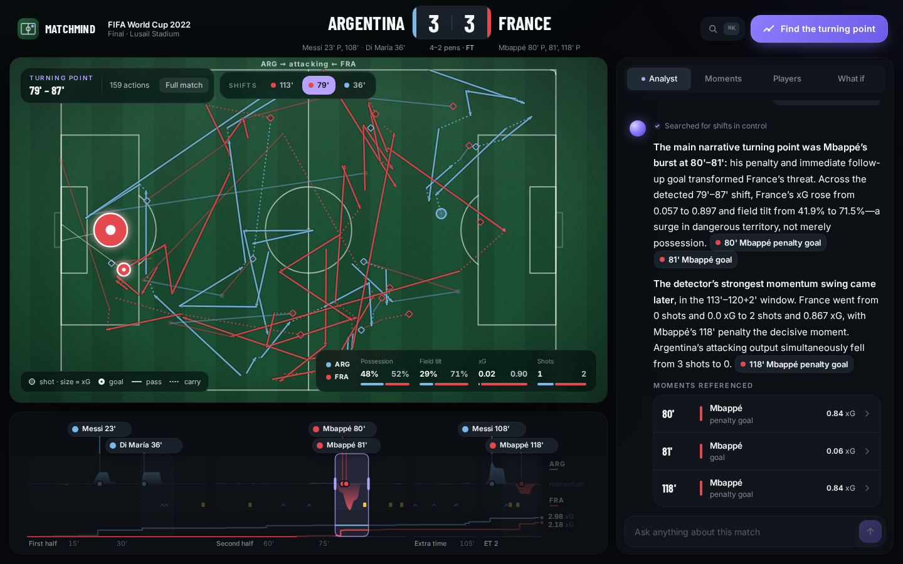
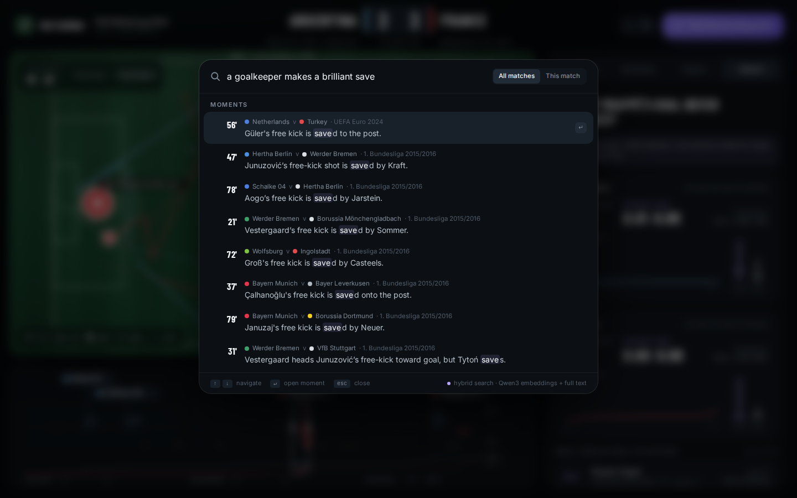
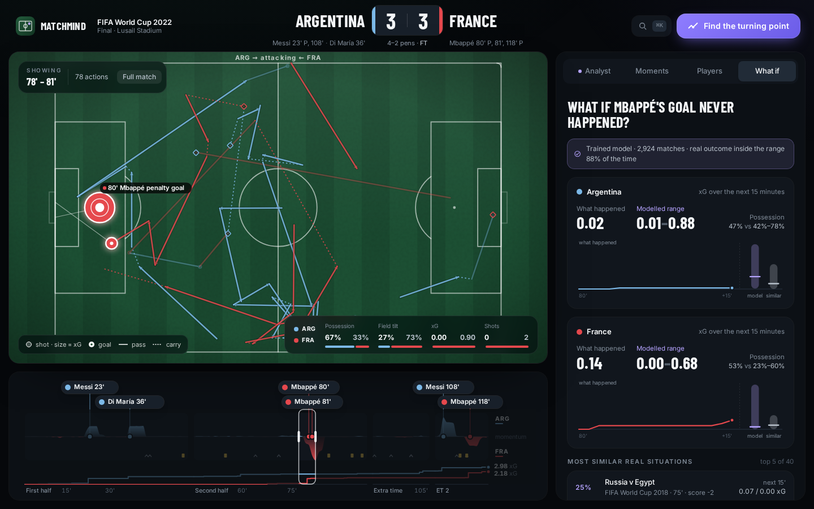
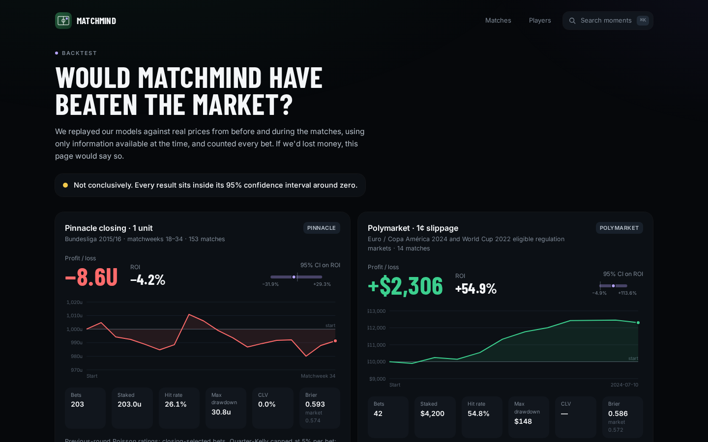
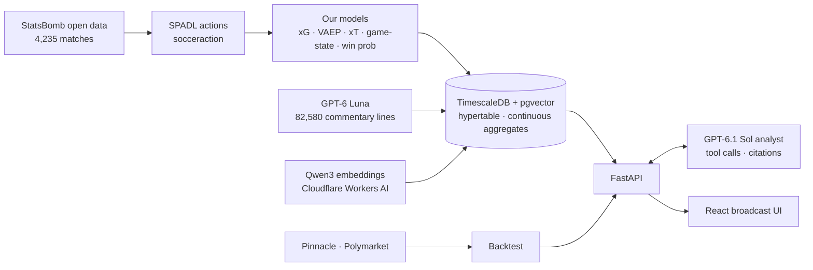

# MatchMind

**An AI football analyst that explains *why* a match turned, backs every claim with the events behind it, and is honest about what it can't predict.**

Stats apps tell you what happened: 62% possession, 1.8 xG. MatchMind shows you why. Replay any of 493 matches on a tactical pitch, find the moment it turned, ask questions in plain English, search every move ever played in the dataset, and see what our models would have done against real betting markets.

> Built in 24 hours at **StormHacks 2026** (Simon Fraser University).



## What you can do

- **Replay any match.** Every pass, carry and shot on a broadcast-style pitch, synced to a timeline of momentum (our VAEP model), cumulative xG and every goal, card and sub. Drag the timeline to set a window; the pitch and the stats follow.
- **Find the turning point.** Change-point detection on the momentum series finds the three biggest shifts in control; the analyst explains them.
- **Ask the analyst (GPT-6.1 Sol).** It answers by calling our analytics as tools and cites the exact moments: every citation is a chip that jumps the pitch there. Numbers come only from tool results, never from the language model.
- **Read the live commentary (GPT-6 Luna).** 82,580 broadcast-style lines, one for every move in every match, written only from facts in the event data. They appear as a feed, and as captions on the pitch when a move is replayed.
- **Search every moment (⌘K).** Hybrid semantic + keyword search across all 493 matches: "a goalkeeper makes a brilliant save" finds saves that never use those words. Pick a result to jump straight to the move.
- **Ask "what if?"** Remove a goal, a substitution or a red card and see the trained game-state model's range for the next 15 minutes, next to the most similar real situations from 2,924 matches.
- **See who really mattered.** Players ranked by value added (VAEP), not pass counts.
- **Check us against the market.** A full backtest against Pinnacle and Polymarket, with confidence intervals and every bet listed.

| | |
|---|---|
|  |  |
|  |  |

## Models we trained

All models were trained on **2,924 men's matches** (5.96 million on-ball actions) from StatsBomb's open data, with **grouped cross-validation by match**: every number shown for a match comes from a model that never saw that match.

| Model | What it does | Held-out result |
|---|---|---|
| **xG** (LightGBM, 73,598 shots, incl. defender/keeper positions from freeze frames) | Probability a shot becomes a goal | Log loss **0.2629** vs StatsBomb's own model **0.2628**; AUC 0.823 vs 0.825. Total xG 7,993 vs 7,996 actual goals. |
| **VAEP** (socceraction + LightGBM) | Value each action adds to the chance of scoring / conceding | AUC **0.820** (scores), **0.806** (concedes). Messi ranks #1 in the dataset at 0.83 VAEP/90. |
| **xT** (12×8 grid) | Threat value of each pitch zone | — |
| **Game-state model** (LightGBM quantile regression, 106,994 windows) | p10/p50/p90 of next-15-minute xG and possession | p10–p90 coverage **79%** for possession (target 80%), 88% for xG (slightly conservative) |
| **Pre-match result model** (walk-forward xG team ratings, Poisson) | P(home/draw/away) before kick-off | Used in the Pinnacle backtest |
| **In-play win probability** (gradient boosting, test tournaments excluded) | P(home/draw/away) at every minute | Used in the Polymarket backtest |

Full model card: [`backend/matchmind/models/MODELS.md`](backend/matchmind/models/MODELS.md).

## Would it have beaten the market?

We replayed the models against real prices using only information available at the time.

| Strategy | Bets | P&L | ROI | 95% CI |
|---|---:|---:|---:|---|
| Pre-match vs **Pinnacle** closing odds (Bundesliga 2015/16, flat 1 unit) | 203 | **−8.6 units** | −4.2% | −31.9% to +29.3% |
| In-play vs **Polymarket** (Euro 2024, $100 bets, 1¢ slippage) | 42 | **+$2,306** | +54.9% | −4.9% to +113.6% |

**Verdict: no demonstrated edge.** Pinnacle's closing line beat us, as expected for the sharpest price in football. The Polymarket result is positive, but 42 bets on 14 matches is too few to rule out luck, and historical prices don't prove the bets would have been filled. Kalshi had no markets for any of our matches (its football markets start in 2025). Method, leakage guards and every number: [`backend/matchmind/backtest/BACKTEST.md`](backend/matchmind/backtest/BACKTEST.md).

## How it works



- **The language model only explains.** Sol answers by calling tools (`get_window_stats`, `find_turning_points`, `get_top_sequences`, `run_counterfactual`, `search_moments`, …) that run our Python analytics. It must cite the event IDs those tools return; an automated check verifies every number in its answers appears in the tool results.
- **TimescaleDB** stores 1.75 million events in a hypertable with a per-minute continuous aggregate (timeline queries in ~1 ms) and **pgvector** HNSW indexes for commentary search.
- **Luna** writes commentary from structured facts only (players, zones, xG, score, outcome); spot checks found no unsupported claims.
- **Search** fuses Qwen3 embedding similarity with Postgres full-text rank (reciprocal rank fusion).

## Data

| Competition | Matches |
|---|---:|
| FIFA World Cup 2022 | 64 |
| UEFA Euro 2024 | 51 |
| Bundesliga 2015/16 (full season) | 306 |
| Bundesliga 2023/24 (Leverkusen) | 34 |
| Copa América 2024 | 32 |
| MLS 2023 (Inter Miami) | 6 |
| **Demo total** | **493** |

The models train on all 2,924 men's matches in StatsBomb's open data. That includes 273 matches present in the dataset's event files but missing from its match index (the rest of Bundesliga 2015/16 and two others); we rebuilt their teams and scores from the events and validated the method on all 3,961 indexed matches.

## Tech stack

- **Data & models:** Python 3.12, pandas, socceraction, LightGBM, scikit-learn, ruptures
- **API:** FastAPI, server-sent events for streaming answers
- **Database:** TimescaleDB (hypertables, continuous aggregates) + pgvector
- **AI:** Azure OpenAI GPT-6.1 Sol (analyst) and GPT-6 Luna (commentary); Qwen3-Embedding-0.6B on Cloudflare Workers AI
- **Frontend:** React, TypeScript, Vite, Tailwind, D3, Motion

## Running locally

```sh
git clone --depth 1 https://github.com/statsbomb/open-data data/raw/statsbomb   # ~17 GB
docker compose up -d db
cp backend/.env.example backend/.env       # Azure OpenAI + Cloudflare credentials
cd backend && uv sync --all-groups
uv run python -m matchmind.db.load init && uv run python -m matchmind.db.load load-catalogue
uv run python -m matchmind.db.load load-events --source raw --demo-only
uv run python -m matchmind.models.backfill && uv run python -m matchmind.db.load refresh
uv run uvicorn matchmind.api.main:app --port 8000
cd ../frontend && npm install && npm run dev  # http://localhost:5173
```

Training, commentary generation and the backtest each have their own CLIs (`matchmind.models.*`, `matchmind.analyst.commentary`, `matchmind.backtest`); see the docs below. The frontend also runs standalone on the committed fixtures: `npm run dev:fixtures`.

## Project docs

- [`PLAN.md`](PLAN.md): build plan and API contract
- [`AGENTS.md`](AGENTS.md): conventions for the coding agents that helped build this
- [`backend/matchmind/models/MODELS.md`](backend/matchmind/models/MODELS.md): model card
- [`backend/matchmind/backtest/BACKTEST.md`](backend/matchmind/backtest/BACKTEST.md): market backtest

## Data & attribution

Match event data: [StatsBomb Open Data](https://github.com/statsbomb/open-data), under the StatsBomb public data user agreement. Bookmaker odds: [football-data.co.uk](https://www.football-data.co.uk). Prediction-market prices: Polymarket public API. MatchMind is not affiliated with StatsBomb, FIFA, UEFA, any club or league, or any bookmaker or market. Nothing here is betting advice.
