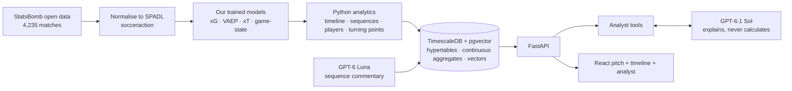

# MatchMind

**An AI football analyst that explains *why* a match turned, and models *what could have happened instead*.**

Stats apps tell you what happened: 62% possession, 1.8 xG. MatchMind tells you why. Pick a match, watch it replay on a tactical pitch, and ask questions in plain English:

- *"Why did Spain lose control between the 55th and 70th minute?"*
- *"Who was actually progressing the ball, not just piling up passes?"*
- *"Show me the three sequences that created the most danger."*
- *"What if Mbappé's penalty had been missed?"*

Every answer is grounded in real match events. The numbers come from our own trained models and Python analytics, never from the language model, and every claim links to the moment on the pitch it refers to.

> 🚧 Built in 24 hours at **StormHacks 2026**. Work in progress.

<!-- TODO: hero screenshot / GIF -->

## Features

- **Tactical replay.** Every pass, carry and shot on an animated 2D pitch, synced to a match timeline of possession, xG, field tilt and momentum. Click anywhere on the timeline to jump the pitch there.
- **AI analyst with citations.** Ask anything about the match. Answers stream in with clickable references to the exact events and sequences behind each claim.
- **Find the turning point.** One click runs change-point detection on the match's momentum and explains the biggest shift in control.
- **Who really mattered.** Players ranked by the value their actions added (VAEP), not by pass counts.
- **What if.** Change a goal, substitution or red card and see a modelled range of how the next 15 minutes might have gone, alongside real historical matches that were in the same situation. Always shown as a modelled hypothetical, never a prediction of what definitely would have happened.
- **Search every match.** "Every time a team broke down the left after a turnover", across all loaded matches.

## Matches

| Competition | Matches |
|---|---|
| FIFA World Cup 2022 | 64 |
| UEFA Euro 2024 | 51 |
| Bundesliga 2023/24 (Bayer Leverkusen) | 34 |
| Copa América 2024 | 32 |
| MLS 2023 (Inter Miami) | 6 |
| Bundesliga 2015/16 (full season) | 306 |
| **Total** | **493** |

Models are trained on all **2,924** men's matches in StatsBomb's open data. That includes 273 matches we found in the dataset's event files but missing from its match index; we rebuilt their teams and scores from the events and validated the method on all 3,961 indexed matches.

## How it works



**The language model only explains.** When you ask a question, the analyst (GPT-6.1 Sol on Azure OpenAI) calls tools like `get_window_stats`, `find_turning_points` and `run_counterfactual`. Those run our Python analytics and models. The model writes the explanation from the tool results and must cite the event IDs they return, so every number on screen can be traced back to real data.

### Models we trained

| Model | What it does | Method | Validation |
|---|---|---|---|
| **xG** | Probability a shot becomes a goal | LightGBM on ~70k shots | *TODO: log loss / Brier vs StatsBomb xG* |
| **VAEP** | Value each action adds to scoring and conceding chances | socceraction VAEP, LightGBM | *TODO: AUC* |
| **xT** | Threat value of each pitch zone | socceraction expected-threat grid | — |
| **Game-state** | Range of outcomes for the next 15 minutes given the match state | LightGBM quantile regression (p10/p50/p90) | *TODO: interval coverage* |
| **Turning point** | Biggest shift in match control | `ruptures` change-point detection on momentum | — |

### A note on the counterfactuals

The game-state model learns from real matches, where teams make substitutions *because* of how the game is going. That makes the effect of a change hard to isolate, so MatchMind never gives a single "this would have happened" answer. It shows a modelled range next to real historical analogs, and labels it as a hypothetical.

## Tech stack

- **Data & models:** Python 3.12, pandas, socceraction, LightGBM, ruptures
- **API:** FastAPI with streaming responses
- **Database:** TimescaleDB (hypertables, continuous aggregates) + pgvector
- **AI:** Azure OpenAI: GPT-6.1 Sol (analyst), GPT-6 Luna (commentary), embeddings
- **Frontend:** React, TypeScript, Vite, Tailwind, D3, Framer Motion

## Running locally

> Setup commands will be finalised once the scaffold lands.

```sh
git clone --depth 1 https://github.com/statsbomb/open-data data/raw/statsbomb
docker compose up -d db
cp backend/.env.example backend/.env    # add Azure OpenAI credentials
cd backend && uv sync && uv run uvicorn matchmind.api.main:app --port 8000
cd frontend && npm install && npm run dev
```

Then open http://localhost:5173.

## Project docs

- [`PLAN.md`](PLAN.md): build plan, API contract, design brief
- [`AGENTS.md`](AGENTS.md): conventions for coding agents

## Team

<!-- TODO: names -->

Built at StormHacks 2026, Simon Fraser University.

## Data & attribution

Match event data from [StatsBomb Open Data](https://github.com/statsbomb/open-data), used under the StatsBomb public data user agreement. MatchMind is not affiliated with StatsBomb, FIFA, UEFA or any club or league. Any third-party data used for the demo is not redistributed in this repository.
